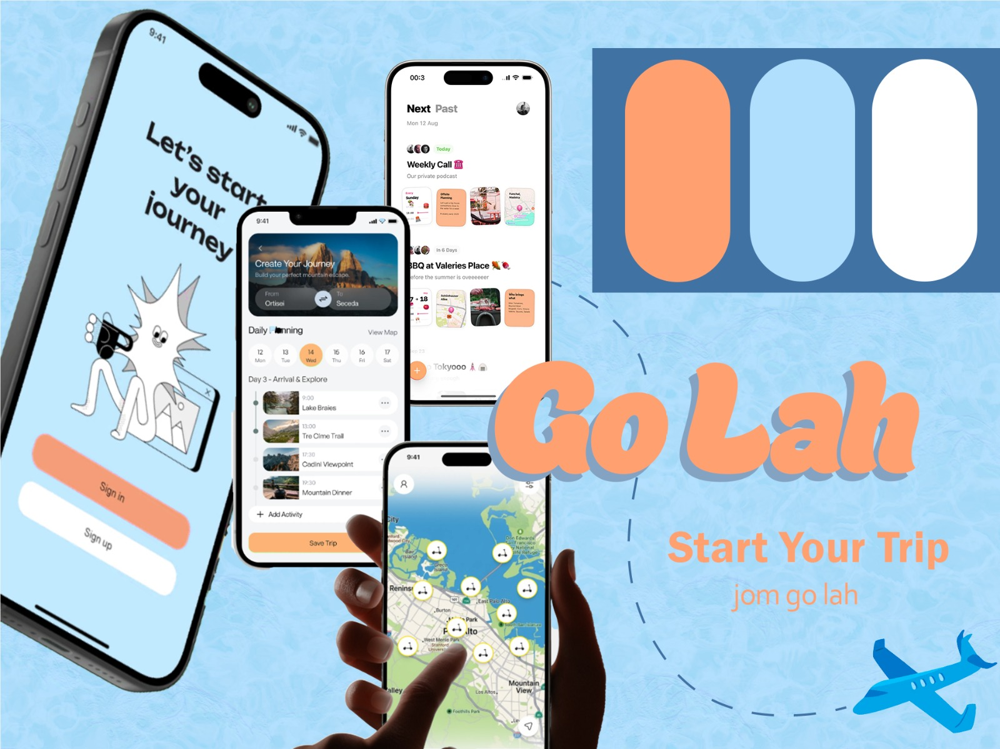
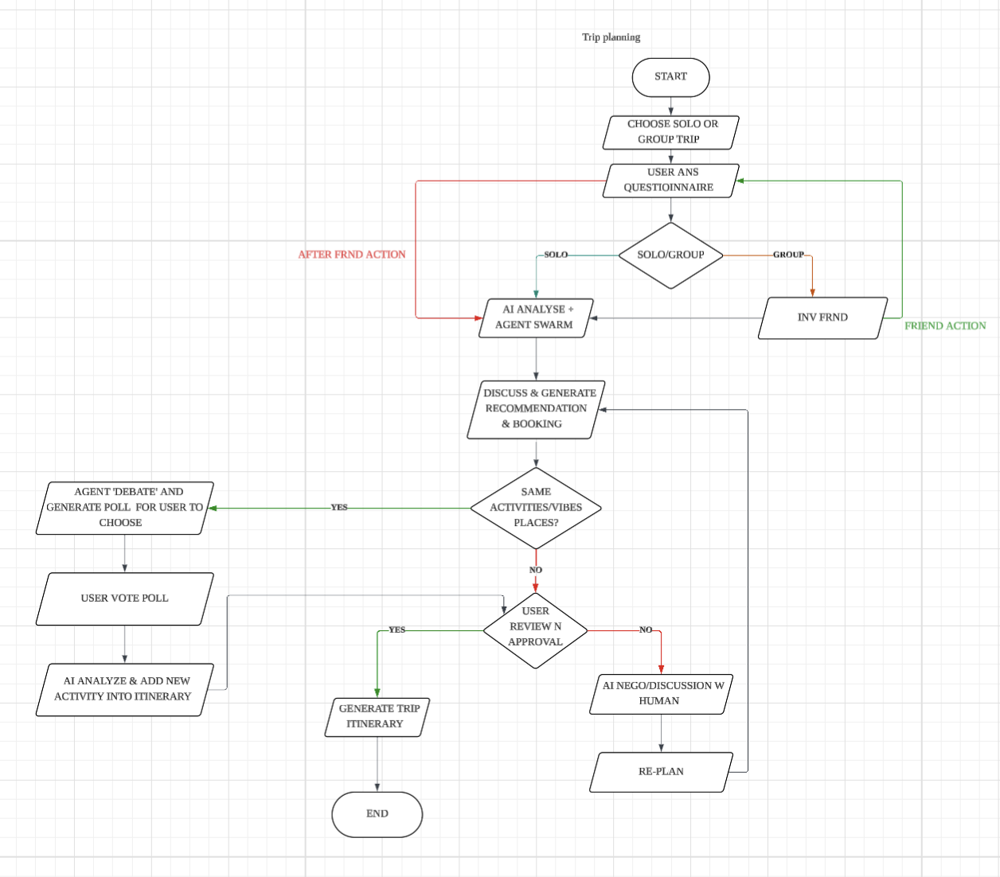
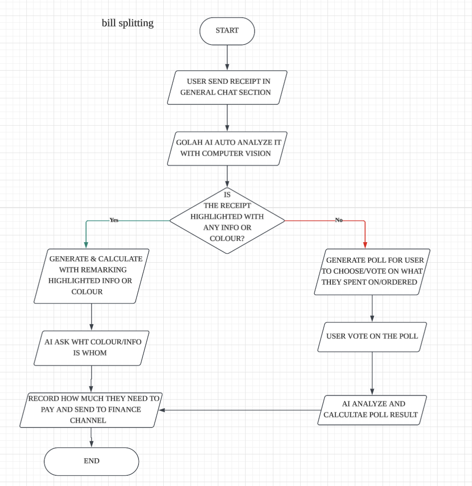
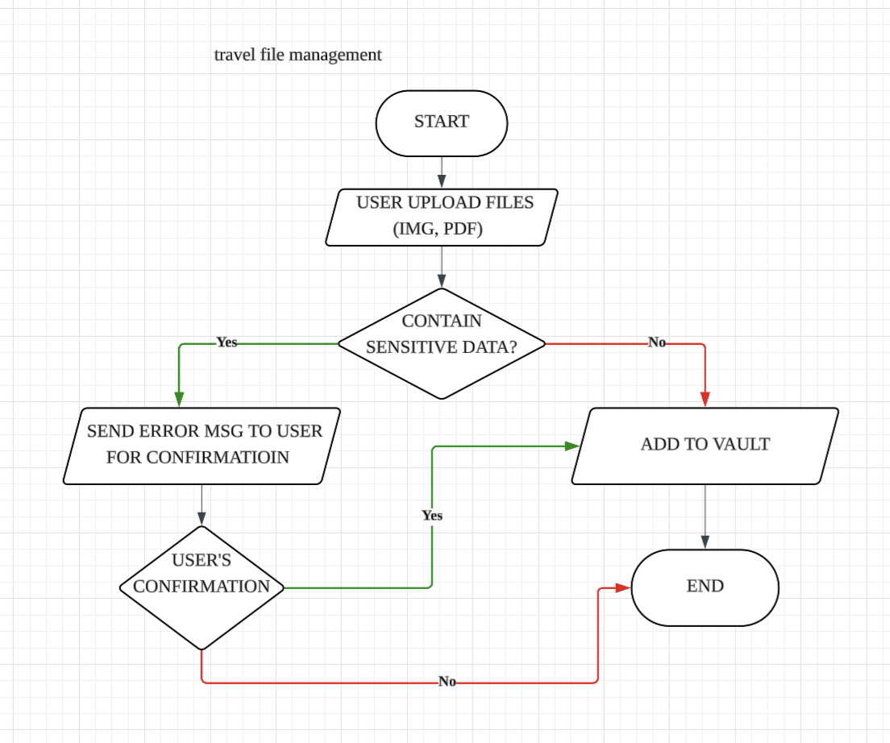
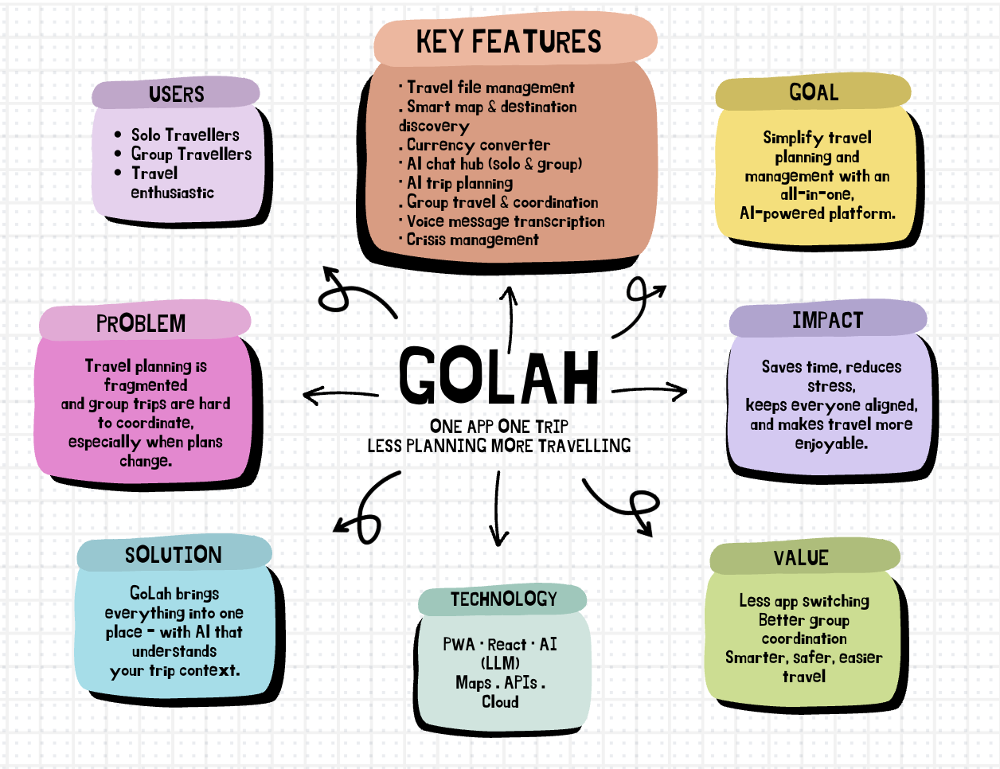
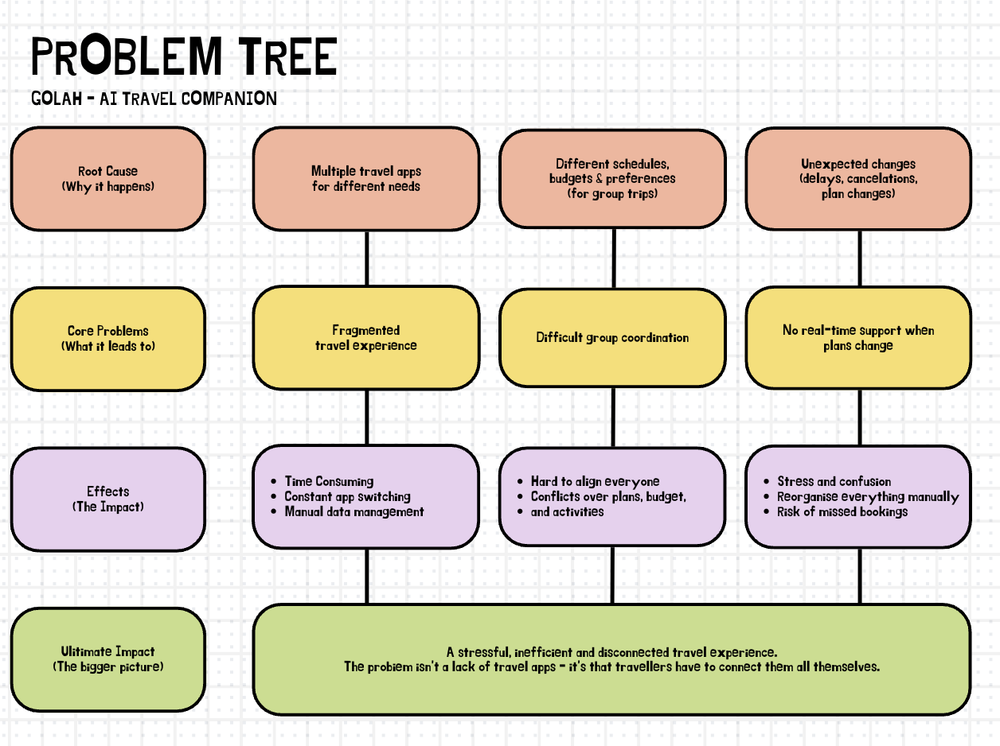
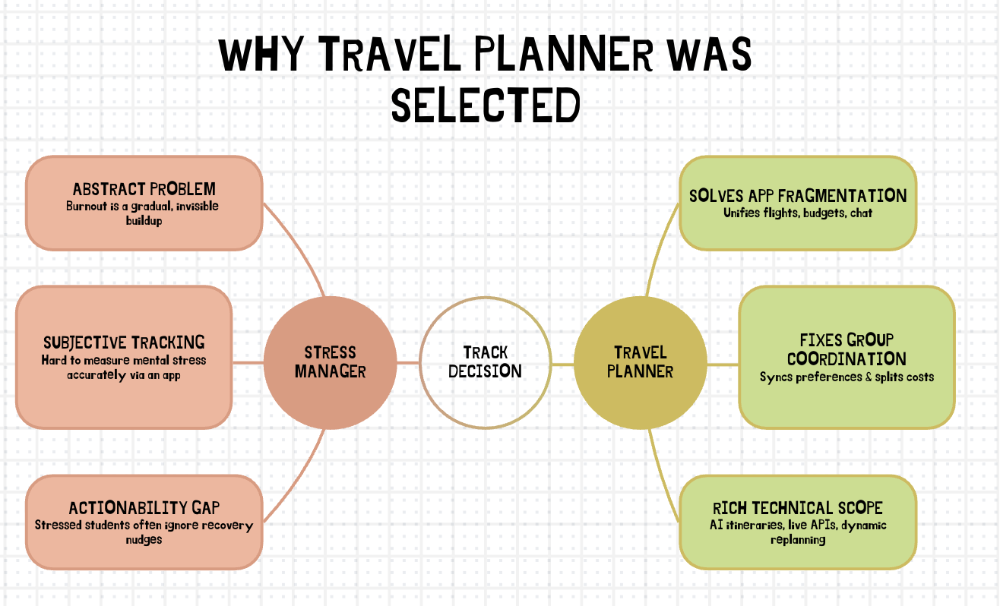
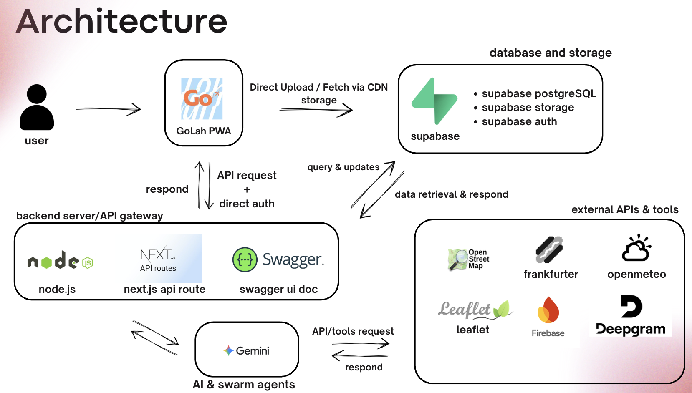

# ✈️ GoLah

> **One app. One trip. Your AI travel companion.**

**Team:** Chor Yun Xin · Ang Jie Ying · Kung Xuan Yu  
**Problem Statement:** Travel Planner  
**Video Presentation:** [Unlisted YouTube Link]  
**Presentation Slides:** [Public Link](https://canva.link/5y3bbbvc630oqnc)
**UI Prototype:** [Public Link](https://codenection-go-lah.vercel.app/)

---

## 📑 Table of Contents

- [1. 🚀 Project Overview](#1--project-overview)
- [2. 💡 Ideation & Process](#2--ideation--process)
  - [2.1 Ideas We Considered](#21-ideas-we-considered)
  - [2.2 Ideation Boards](#22-ideation-boards)
  - [2.3 Mentor Consultation](#23-mentor-consultation)
- [3. 🎨 Design & Prototype](#3--design--prototype)
- [4. ✨ What Makes It Different](#4--what-makes-it-different)
- [5. 🛠️ Technical Architecture & Feasibility](#5--technical-architecture--feasibility)
  - [5.1 Tech Stack](#51-tech-stack)
  - [5.2 System Architecture](#52-system-architecture)
  - [5.3 AI Agent Architecture](#53-ai-agent-architecture)
  - [5.4 Build Plan & Scope](#54-build-plan--scope)

---

# 1. 🚀 Project Overview

**The Problem** 
Travel planning is fragmented across multiple apps, forcing travellers to switch between platforms for itineraries, maps, travel documents, currency, communication, and group coordination. This becomes even more difficult for group travellers, who need to coordinate preferences, plans, and expenses across different tools. The main stakeholders are solo travellers, group travellers, and travel-related service providers. Existing apps such as TripIt help organise travel itineraries, but they mainly focus on itinerary management and do not provide an integrated experience for AI assistance, group coordination, bill splitting, travel files, community discovery, and crisis support.

**Our Solution**
GoLah is an AI-powered travel companion that brings trip planning, travel information, communication, and essential travel tools into one platform. Instead of switching between multiple apps, travellers can manage their itinerary, travel files, maps, currency, group chat, bill splitting, and travel assistance within a single trip-based platform. Its context-aware multi-agent AI uses relevant trip, group, and conversation information to provide more personalised assistance. GoLah supports both solo and group travellers, helping them plan, coordinate, discover, and handle unexpected travel situations in one place.

### 🌟 Key Features

| Feature | What it does |
| :--- | :--- |
| 📁 **Travel Files Management** | Centralised storage for passports, visas, boarding passes, hotel reservations, insurance, eSIM info, and emergency contacts. |
| 🗺️ **Smart Map** | Destination exploration with AI-assisted routes, live pricing/availability where supported, booking options, trip-context recommendations, and community comments, reviews, and photos. |
| 💱 **Currency Converter** | Live exchange rates and quick currency conversion. |
| 🤖 **AI Chat Hub** | Solo and Group modes with AI that understands relevant trip context. |
| 🧳 **AI Trip Planning** | Swipe-based destination discovery, AI-powered group destination decisions, and automatic bill splitting. |
| 💬 **Group Travel** | Shared trips, group chat, media sharing, preference coordination, shared itineraries, and AI-assisted bill splitting. |
| 🎙️ **Voice Message Transcription** | Voice messages are transcribed in the backend so GoLah AI can understand them as conversation and trip context. |
| 🚨 **Crisis Management** | Assistance for flight delays, plan changes, cancellations, and accidents within the same platform. |
| 📝 **Travel Status & Posts** | Users can share travel-related posts or statuses, helping others discover ideas when they are unsure where or what to travel. |
| #️⃣ **Chat Hub Sections** | Users can organise important conversations into sections inside the Chat Hub, inspired by Discord-style channels while keeping everything within the trip chat. |

---

# 2. 💡 Ideation & Process

## 2.1 Ideas We Considered

The following ideas were evaluated during ideation, with the selected concepts listed first.

| 💡 Idea | Decision | Reason |
| :--- | :--- | :--- |
| **Centralized AI Trip Planning** | ✅ Chosen | Dynamic trip planning based on destination, dates, budget, provider options, and personal preferences. |
| **AI Swarm Agents Architecture** | ✅ Chosen | Specialized agents handle tasks such as logistics, routing, finance, crisis, and recommendations. |
| **Smart Map & Attraction Reviews** | ✅ Chosen | Combines AI routes, live pricing/availability where supported, booking options, and community reviews/photos. |
| **Structured File Management** | ✅ Chosen | Keeps important travel information and documents organised in one place. |
| **AI Travel Chatbot & Companion** | ✅ Chosen | Context-aware AI available in Solo and Group modes instead of as a standalone generic chatbot. |
| **Integrated Bill Splitting** | ✅ Chosen | Lets group travellers split bills directly with AI assistance. |
| **Voice Message Transcription** | ✅ Chosen | Converts voice messages to text so the AI can understand and use them as conversation/trip context. |
| **Crisis Management Hub** | ✅ Chosen | Provides support during disruptions, cancellations, accidents, and unexpected travel problems. |
| **Travel Status & Community Posts** | ✅ Chosen | Lets users share travel ideas, statuses, and posts so others can discover destinations and activities when they have no idea where to go. |
| **Chat Hub Sections** | ✅ Chosen | Adds Discord-inspired sections/channels inside the Chat Hub so users can separate and find important conversations more easily. |
| **Two-Way Voice Calling with AI** | ❌ Dropped | Too technically complex; voice-message transcription provides useful AI access without live AI calls. |
| **Group Memories & Photo Album** | ❌ Dropped | Users can already rely on native shared albums such as Apple iCloud Shared Albums or Google Photos. |
| **Group-Only Travel Coordination App** | ❌ Dropped | Solo travellers face the same fragmentation problem, so GoLah supports both solo and group travel. |
| **Standalone Expense Tracking** | ❌ Dropped | AI bill splitting and currency conversion already cover the core financial needs for the current scope, making a separate expense-tracking feature unnecessary. |

## 2.2 Ideation Boards

### 🎨 Moodboard



The moodboard captures GoLah's visual direction, combining travel inspiration with a friendly, modern, and approachable product experience.

### 🗺️ Trip Planning User Flow



This user flow diagram illustrates the step-by-step journey for both solo and group trip planning, including the AI negotiation and approval process.

### 💸 Bill Splitting User Flow



This user flow shows how GoLah helps group travellers record shared expenses, calculate each person's share, and settle the bill with AI assistance.

### 📁 Travel File Management User Flow



This user flow shows how travellers organise and access important documents and travel information in one centralised space.

### 🧠 Mindmap



The mind map shows how the team's ideas expanded from the central travel-planning problem into GoLah's major feature areas.

### 🌳 Problem Tree



The problem tree shows the root causes and consequences of fragmented travel planning and how the problem affects both individual and group travellers.

### ❓ Why We Choose Travel Planner


**We started with the Stress Manager idea, but realized it had limitations.**
Stress is highly personal, and it is difficult to understand how someone truly feels based only on their inputs. We also felt that users may not always act on generic stress-management suggestions, while the market already has many similar solutions.

**Travel planning felt more natural to us because we experience the problem ourselves.**
As people who travel, we understand the frustrations of planning a trip — deciding where to go, what to do, managing schedules and budgets, and even planning when we have no idea where to start.

**So, we decided to build GoLah — bringing the entire trip-planning experience into one platform, making travel planning simpler, more personalized, and less stressful.**

## 2.3 Mentor Consultation

| 📅 Date | 👤 Mentor | 💬 Key Feedback | 🔄 Our Decision |
| :--- | :--- | :--- | :--- |
| *6/9/2026* | *Looi Wei En* | Recommended a native mobile app because several core features are well suited to native capabilities. | **Retained PWA.** We prioritised instant cross-device access and easy sharing, while keeping the app installable from the browser without requiring a traditional app-store installation. |
| *7/9/2026* | *Daniel Koh Yu Hang* | Recommended keeping the Finance Agent for bill splitting, and  suggested expense tracking with notification reading | **Kept the Finance Agent** while removing unnecessary agents. Removed expenses tracking, so notification reader was no longer needed. |
| *7/9/2026* | *Daniel Koh Yu Hang* | Encouraged supporting local travel | Changed destination selection to a **text-based input** with **multiple answers**, allowing both international and local destinations. |
| *7/9/2026* | *Daniel Koh Yu Hang* | Recommended using RAG where needed to reduce “I don’t know” responses. | Discussed and decided that **RAG was unnecessary** and focused on improving agent system prompts instead. |
| *10/9/2026* | *Stefan Khor Jia Quan* | Advised that Supabase’s free-tier storage is sufficient and that adding Cloudflare R2 is unnecessary.| **Removed Cloudflare R2** and decided to use Supabase Storage only. |
---

# 3. 🎨 Design & Prototype

**UI Prototype:** [[Public Link](https://codenection-go-lah.vercel.app/)]

> 💡 *Check that the prototype opens in an incognito window. Embed or link 4–8 key screens with short captions explaining the main interactions.*

---

# 4. ✨ What Makes It Different

GoLah treats the **trip as the central object** and layers context-aware AI on top of a unified travel platform, rather than solving only one part of the travel experience.

## 🌟 Novel Features

### 1. 🤖 Context-Aware AI Assistant
Unlike generic travel chatbots, GoLah AI retrieves relevant information from the user's actual trip — such as itinerary, group preferences, travel files, chat history, and current trip context — before generating a response.

> Example: *“Are we free tomorrow afternoon?”* → GoLah checks the itinerary instead of guessing.

### 2. 🗳️ AI-Powered Group Destination Debate
GoLah AI compares destination options against each group member's preferences, such as budget, interests, and activity style, to support a more data-informed group decision.

### 3. 🎙️ Voice Message Transcription for AI Context
Users can send voice messages, which are converted to text through speech-to-text processing. The transcript becomes part of the relevant conversation context, allowing the AI to understand voice messages and respond through normal text chat.

> **Note:** AI voice calls and AI-generated voice replies are not part of the current MVP.

### 4. 🚨 Crisis Management Inside the Travel Platform
Instead of searching across multiple apps during stressful situations such as flight delays or plan changes, GoLah provides relevant assistance inside the same platform where the trip is managed.

### 5. 📂 Structured Travel Information + Files
Structured travel information such as flight details, and hotel reservations is stored separately from uploaded documents.

### 6. 🗺️ Smart Map with Community Travel Information
The Smart Map combines travel discovery, trip-context recommendations, live pricing/availability where supported, and community-generated comments, reviews, and photos.

### 7. 👥 Swipe-Based Discovery with Group Consensus
Travellers can swipe through destinations and rate them, while group preferences can be used to support AI-assisted destination decisions.

### 8. 📝 Community Travel Status & Posts
Users can share travel experiences, ideas, statuses, or destinations they are considering. This gives travellers who are **unsure where to go and do** a source of inspiration from other users.

### 9. #️⃣ Organised Chat Hub Sections
The Chat Hub introduces Discord-inspired sections inside the group conversation, allowing users to separate important topics and make key messages easier to find without leaving the Chat Hub.

---

# 5. 🛠️ Technical Architecture & Feasibility

## 5.1 Tech Stack

### 💻 Frontend
- React
- Next.js
- TypeScript
- Tailwind CSS
- Progressive Web App (PWA)

### ⚙️ Backend
- Node.js
- Next.js API Routes
- Swagger ui documentation

### 🗄️ Database & Storage
- Supabase
- PostgreSQL
- Supabase Storage
- Supabase Realtime where appropriate

### 🧠 AI
- LLM: **Gemini AI**
- Speech-to-Text: **Deepgram**
- AI Tool Calling
- AI Context Management

### 🗺️ Maps & Travel Services
- Maps API: **leaflet** (with OpenStreetMap)
- Currency API: **frankfurter**
- Weather API: **openmeteo**
- Places API: **Google Places**
- Push Notification Service: **Firebase**

## 5.2 System Architecture

```text
┌─────────────────────────────────────────────────────────────┐
│                         GoLah PWA                            │
│                                                             │
│ Travel Files │ Smart Map │ Currency │ AI Chat │ Group Travel│
│ Trip Planning │ Voice Messages │ Crisis Assistance          │
└──────────────────────────────┬──────────────────────────────┘
                               │
                               ▼
┌─────────────────────────────────────────────────────────────┐
│                      Backend / API                          │
│                                                             │
│ Auth │ Trips │ Itineraries │ Files │ Groups │ Chat │ AI      │
│ Voice Message Processing │ External API Gateway              │
└───────────────┬──────────────────────┬──────────────────────┘
                │                      │
                ▼                      ▼
        ┌───────────────┐      ┌──────────────────────┐
        │    Supabase   │      │   External Services  │
        │               │      │                      │
        │ PostgreSQL    │      │ Maps                 │
        │ Auth          │      │ Push notification    │
        │ Storage       │      │ Currency             │
        │ Realtime      │      │ Places               │
        └───────┬───────┘      │ Weather              │
                │              │ Speech-to-Text       │
                │              └──────────┬───────────┘
                └────────────┬────────────┘
                             ▼
                  ┌────────────────────────┐
                  │      GoLah AI Layer    │
                  │                        │
                  │ Orchestrator Agent     │
                  │ ├─ Trip Planning       │
                  │ ├─ Recommendation      │
                  │ ├─ Finance             │
                  │ ├─ Chat                │
                  │                        │
                  │ Context + Tool Calling │
                  └────────────────────────┘
```



## 5.3 AI Agent Architecture

GoLah uses a **multi-agent AI architecture**.

```text
                         GoLah AI
                            │
                     Orchestrator Agent
                            │
       ┌────────────┬───────┼────────┬─────────────┐
       ▼            ▼                ▼             ▼
 Trip Planning  Recommendation    Finance       Chat Agent
    Agent           Agent          Agent  

```

Agents can read relevant information, use tools, analyse the trip, generate recommendations, detect issues, and prepare actions.

### 🔐 Human Approval & Safety

- **Material itinerary re-planning requires user approval** before changes are applied.
- **Booking, rebooking, cancellation, payment, and other consequential external actions require explicit confirmation.**
- The system must **not claim an external action succeeded** unless the relevant tool/API confirms success.

## 5.4 Build Plan & Scope

The MVP focuses on delivering the required GoLah experience rather than implementing every possible future travel feature.

### 🚀 Core MVP

1. User authentication and profiles.
2. Trip creation and itinerary management.
3. Travel Files management.
4. Smart Map with travel discovery, AI-assisted routes, live pricing/availability where supported, and community comments/reviews/photos.
5. Currency conversion.
6. AI Chat Hub with Solo and Group modes.
7. Multi-agent AI with shared trip/group context.
8. AI-assisted trip planning and group destination decisions.
9. Group chat, shared trips, and **AI-assisted bill splitting**.
10. Voice-message transcription so AI can understand voice messages.
11. Crisis assistance focused on travel disruptions and plan changes.
12. Community travel status/posts for destination inspiration.
13. Organised Chat Hub sections for topic-based conversations.
14. Human approval flow for itinerary re-planning and consequential actions.

### 🚫 Explicitly Not Part of the Current MVP

- AI voice calls.
- AI-generated voice replies / TTS.
- Continuous background voice listening.
- Fully autonomous booking or rebooking.
- Automatic payments.
- Standalone expense tracking.
- Native iOS/Android applications.
- Future predictive travel features unless required by the organizer.

---

> 🧩 **GoLah is designed to stay modular**, allowing future capabilities to be added without redesigning the core system.
